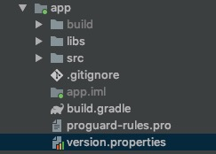
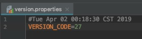
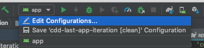
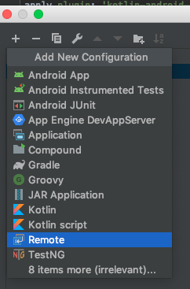
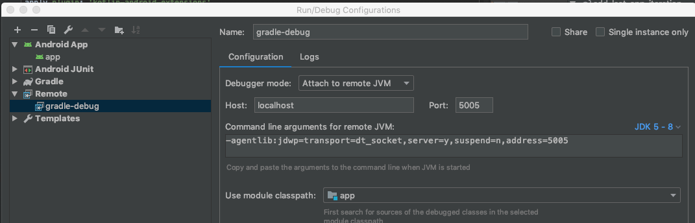
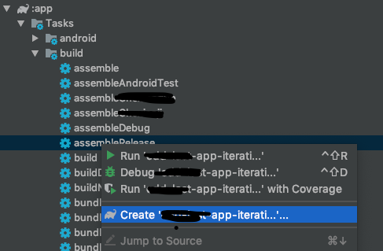
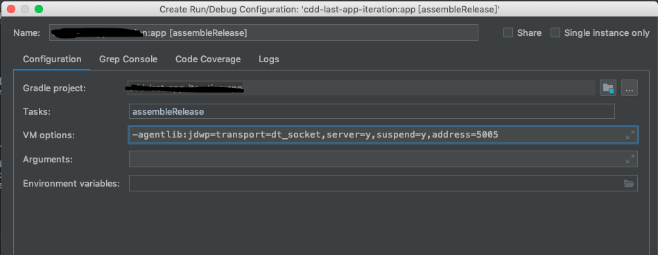
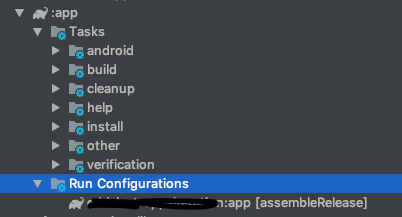

通过脚本实现versionCode自增，避免人工干预。
<!--more-->

### 前言
* app根目录创建version.properties文件
 
* 写入VERSION_CODE=30

* app项目build.gradle添加如下方法，读取versionCode并自增数值

```java
def getVersionCode() {
    def versionFile = file('version.properties')
    if (versionFile.canRead()) {
        Properties versionProps = new Properties()
        versionProps.load(new FileInputStream(versionFile))
        def versionCode = versionProps['VERSION_CODE'].toInteger()
        def runTasks = gradle.startParameter.taskNames
        if ('assembleRelease' in runTasks) {
            versionProps['VERSION_CODE'] = (++versionCode).toString()
            versionProps.store(versionFile.newWriter(), null)
        }
        return versionCode
    } else {
        throw new GradleException("Could not find version.properties!")
    }
}
```

* 通过`getVersionCode()`方法读取`versionCode`

```javascript
def currentVersionCode = getVersionCode()

android {
    ...
    defaultConfig {
        ...
        minSdkVersion min_sdk_version
        targetSdkVersion target_sdk_version
        versionCode currentVersionCode
        versionName version_name
        ...
    }
    ...
}
```
#### gradle脚本调试
> 因为在测试的过程中发现不起作用，所以需要调试脚本来检测是哪里出了问题，这里记录下调试的方法，AS版本3.3.2。

* Edit Configurations -> Add New Configuration
 
* Remote -> OK创建  
 
 
* Gradle -> :app -> build -> assembleRelease右键 -> 
Create... 
 
* VM options填入

*-agentlib:jdwp=transport=dt_socket,server=y,suspend=y,address=5005*

 
* 生成新的RunConfiguration

* 双击刚才创建的Run Configurations，此时会线程阻塞，返回debug原先创建Remote Debug即可开始调试。
